# 🛍️ Online Boutique — CI/CD, Container Security & GitOps Pipeline

[](https://github.com/miguelortiz13/online-boutique-ci/actions/workflows/ci.yaml)
[](https://github.com/miguelortiz13/online-boutique-ci/security/code-scanning)
[](https://www.sigstore.dev/)
[](https://github.com/anchore/syft)
[](https://azure.microsoft.com/services/container-registry/)
[](https://github.com/miguelortiz13/platform-gitops)

Repositorio oficial del **Proyecto 2 (`online-boutique-ci`)** dentro del **Laboratorio Integral de DevOps & SRE**. Implementa un pipeline de Integración Continua (CI) empresarial para la arquitectura de microservicios de **Google Online Boutique**, incorporando filtrado diferencial de rutas, control de calidad shift-left, escaneo avanzado de vulnerabilidades, inventario SBOM, autenticación sin secretos vía OIDC hacia Azure, firma criptográfica *keyless* y promoción automatizada hacia el repositorio GitOps.

---

## 🏗️ 1. Diagrama de Arquitectura de Extremo a Extremo

```mermaid
flowchart TD
    subgraph DevWork ["💻 Desarrollo y Control de Versiones"]
        Commit["Git Commit / PR"] --> EventFilter{"Tipo de Evento"}
    end

    subgraph Phase1 ["⚡ 1. Detección Selectiva de Cambios"]
        EventFilter -->|Pull Request / Push / Dispatch| PF["dorny/paths-filter@v3"]
        PF --> SvcDetect["Determinar Microservicios Modificados"]
        SvcDetect --> SvcMatrix["Matriz Dinámica JSON<br/>(Ej: frontend, cartservice)"]
    end

    subgraph Phase2 ["🛡️ 2. Validación Shift-Left"]
        SvcMatrix --> Hadolint["Hadolint Dockerfile Linter<br/>(Failure: warning)"]
        SvcMatrix --> UnitTests["Pruebas Unitarias Automatizadas<br/>(Go 1.27 / .NET 10.0)"]
    end

    subgraph Phase3 ["📦 3. Compilación y Artefactos de Seguridad"]
        Hadolint & UnitTests --> Buildx["Docker Buildx + QEMU<br/>(Cache GHA tipo gha,mode=max)"]
        Buildx --> Syft["Generación SBOM (Syft)<br/>Formato: SPDX 2.3 JSON"]
        Syft --> TrivySarif["Trivy SARIF Scanner<br/>(Publicación a GitHub Security Tab)"]
        TrivySarif --> TrivyGate["Trivy Quality Gate<br/>(Bloqueo ante CRITICAL no mitigadas)"]
    end

    subgraph Phase4 ["🔐 4. Publicación en ACR y Firma Criptográfica"]
        TrivyGate --> AzureOIDC["Autenticación Azure OIDC<br/>(Secretless via Microsoft Entra ID)"]
        AzureOIDC --> ACRPush["Push de Imagen a ACR<br/>(Etiqueta inmutable: sha-short)"]
        ACRPush --> CosignSign["Firma Keyless con Cosign<br/>(Certificado Fulcio + Rekor Log)"]
        CosignSign --> CosignAttest["Atestación in-toto del SBOM<br/>(cosign attest --predicate)"]
        CosignAttest --> CosignVerify["Verificación de Firma en Pipeline<br/>(Validación de Identidad OIDC)"]
    end

    subgraph Phase5 ["🚀 5. Promoción GitOps Desacoplada"]
        CosignVerify --> KustomizeSetup["Setup Oficial de Kustomize"]
        KustomizeSetup --> CloneGitOps["Clonación de platform-gitops<br/>(Token con Menor Privilegio)"]
        CloneGitOps --> KustomizeEdit["kustomize edit set image<br/>(overlays/dev/kustomization.yaml)"]
        KustomizeEdit --> CreatePR["Apertura Automática de PR<br/>(promote/servicio-tag hacia main)"]
    end

    subgraph Downstream ["☸️ 6. Despliegue Continuo (P3 - GitOps)"]
        CreatePR --> ArgoCD["Argo CD / Kubernetes AKS<br/>(Reconciliación y Admisión Kyverno)"]
    end

    classDef stage fill:#f0f7ff,stroke:#0366d6,stroke-width:2px;
    classDef security fill:#e6ffed,stroke:#2ea44f,stroke-width:2px;
    classDef gitops fill:#fff8c5,stroke:#d4a72c,stroke-width:2px;
    class Phase1,Phase2 stage;
    class Phase3,Phase4 security;
    class Phase5,Downstream gitops;
```



---

## 📊 2. Matriz de Componentes del Pipeline

| Etapa | Herramienta | Rol / Propósito | Estándar / Política |
| :--- | :--- | :--- | :--- |
| **Detección** | `dorny/paths-filter@v3` | Compilación condicional de microservicios modificados | Matriz dinámica `json`, ejecución exclusiva sobre código impactado |
| **Linting** | Hadolint v3.1.0 | Análisis estático de buenas prácticas en Dockerfiles | Reglas empresariales en `.hadolint.yaml` (`DL3008`, `DL3018`, etc.) |
| **Testing** | Go Test & .NET Test | Pruebas unitarias automatizadas por lenguaje | Ejecución nativa previa a la construcción de contenedores |
| **Build & Cache** | Docker Buildx + GHA Cache | Construcción de imágenes multi-etapa y cacheo | Cache remoto tipo `gha` con `mode=max` delimitado por microservicio |
| **SBOM** | Anchore Syft v0.24.2 | Software Bill of Materials (inventario de componentes) | Estándar internacional **SPDX 2.3 JSON** |
| **Vulnerabilidades** | Aqua Security Trivy | Detección de CVEs en dependencias y base OS | Exportación SARIF a pestaña Security + Quality Gate CRITICAL |
| **Autenticación** | GitHub Actions OIDC | Conexión sin secretos hacia Microsoft Azure | Credenciales federadas de Entra ID, rol `AcrPush` / `Reader` PoLP |
| **Registro** | Azure Container Registry | Almacenamiento seguro de imágenes y atestaciones | SKU `Basic` (`acrdevsrelab01`), nombres inmutables `sha-<corto>` |
| **Firma Digital** | Sigstore Cosign v3.8.2 | Firma criptográfica e integridad de cadena de suministro | Modelo **Keyless** con Fulcio CA y Rekor Transparency Log |
| **Promoción** | Kustomize v5 + GitHub CLI | Desacoplamiento de CI y CD mediante PR automatizado | Modificación declarativa en repo GitOps [`platform-gitops`](https://github.com/miguelortiz13/platform-gitops) |

---

## 📈 3. Evidencia Empírica de Validación de Hitos

Cada funcionalidad del pipeline ha sido rigurosamente implementada a través de ramas de características y Pull Requests verificadas empíricamente:

| Tarea Azure DevOps | Hito Técnico | PR Origen | Ejecución CI | Evidencia Empírica |
| :--- | :--- | :---: | :---: | :--- |
| **P2-01 (#24)** | Matriz y Dependencias de Servicios | Directo | N/A | Inventario exhaustivo documentado en [`docs/servicios.md`](docs/servicios.md). |
| **P2-02 (#25)** | Paths-Filter y Cache GitHub Actions | [#1](https://github.com/miguelortiz13/online-boutique-ci/pull/1), [#2](https://github.com/miguelortiz13/online-boutique-ci/pull/2) | [Run #36592230156](https://github.com/miguelortiz13/online-boutique-ci/actions/runs/36592230156) | Reducción de tiempo de build de 3m 15s a 52s con cache caliente. |
| **P2-03 (#26)** | Hadolint Linter y Tests Go/.NET | [#3](https://github.com/miguelortiz13/online-boutique-ci/pull/3), [#4](https://github.com/miguelortiz13/online-boutique-ci/pull/4) | [Run #36593450912](https://github.com/miguelortiz13/online-boutique-ci/actions/runs/36593450912) | Bloqueo intencional en PR #4 por violación `DL3007` (tag latest) verificado. |
| **P2-04 (#27)** | Trivy SARIF Scanner, SBOM Syft y Gate | [#5](https://github.com/miguelortiz13/online-boutique-ci/pull/5) | [Run #36594892100](https://github.com/miguelortiz13/online-boutique-ci/actions/runs/36594892100) | 16 hallazgos SARIF cargados en GitHub Security Tab; SBOM SPDX generado. |
| **P2-05 (#28)** | ACR Secretless vía OIDC y Firma Cosign | [#6](https://github.com/miguelortiz13/online-boutique-ci/pull/6) | [Run #36664474194](https://github.com/miguelortiz13/online-boutique-ci/actions/runs/36664474194) | Login OIDC exitoso; imagen firmada; verificación Cosign en CI y CLI local. |
| **P2-06 (#29)** | Promoción GitOps Automatizada a Repo CD | [#7](https://github.com/miguelortiz13/online-boutique-ci/pull/7) | [Run #36670306701](https://github.com/miguelortiz13/online-boutique-ci/actions/runs/36670306701) | Apertura de [PR #1 en platform-gitops](https://github.com/miguelortiz13/platform-gitops/pull/1) actualizando `dev` a `sha-d6d7fb8`. |
| **P2-07 (#30)** | Documentación Integral y Cierre Épica | [#8](https://github.com/miguelortiz13/online-boutique-ci/pull/8) | En ejecución | Publicación de README integral y cierre de Épica #23. |

---

## ⚡ 4. Comparativa de Rendimiento: Cache Frío vs. Cache Caliente

El pipeline utiliza el backend de almacenamiento en cache de GitHub Actions (`type=gha,mode=max`) segmentado por microservicio:

| Microservicio | Tiempo Build en Frío (Cold) | Tiempo Build con Cache (Warm) | Reducción de Tiempo | Capas Reutilizadas |
| :--- | :---: | :---: | :---: | :---: |
| **Frontend (Go)** | `2m 45s` | `0m 48s` | **70.9%** ⚡ | Base Alpine, dependencias Go mod y binario compilado |
| **Cartservice (.NET)** | `3m 15s` | `1m 02s` | **68.2%** ⚡ | Base SDK dotnet, paquetes NuGet restaurados |
| **Pipelines Promedio** | `~3m 00s` | `~0m 55s` | **~69.4%** ⚡ | Descarga masiva de capas base OCI |

---

## 🔒 5. Cadena de Confianza y Seguridad de Suministro (Supply Chain Security)

El pipeline implementa los pilares del estándar **SLSA (Supply-chain Levels for Software Artifacts)**:

### 1. Autenticación Secretless con Microsoft Entra ID (OIDC)
En lugar de almacenar credenciales de servicio estáticas (`CLIENT_SECRET`) con riesgo de filtración:
* GitHub Actions solicita un token JWT con firma criptográfica a `https://token.actions.githubusercontent.com`.
* Microsoft Entra ID valida las *Federated Identity Credentials* vinculadas a los *claims* del repositorio (`repo:miguelortiz13/online-boutique-ci:ref:refs/heads/main` y `pull_request`).
* Azure otorga un token de corta vida (1 hora) con el rol estricto `AcrPush` y `Reader` sobre el registro `acrdevsrelab01`.

### 2. Generación y Atestación de SBOM (Software Bill of Materials)
* Mediante **Syft**, se extrae el árbol completo de dependencias binarias, paquetes de sistema operativo y librerías en formato estándar **SPDX 2.3 JSON**.
* El SBOM se adjunta a la imagen en el ACR como una atestación OCI *in-toto* usando:
  ```bash
  cosign attest --yes --predicate sbom-frontend.spdx.json --type spdx <IMAGE_DIGEST>
  ```

### 3. Firma Digital Keyless con Sigstore Cosign
* Elimina la gestión, rotación y riesgo de robo de claves privadas tradicionales.
* Cosign obtiene un certificado x509 efímero emitido por la entidad certificadora **Fulcio**, respaldado por la identidad OIDC de la ejecución de GitHub Actions.
* La firma queda asentada de forma inmutable y transparente en el log de auditoría global **Rekor**.
* **Comando de verificación pública e independiente:**
  ```bash
  cosign verify \
    --certificate-identity-regexp "https://github.com/miguelortiz13/online-boutique-ci/" \
    --certificate-oidc-issuer "https://token.actions.githubusercontent.com" \
    acrdevsrelab01.azurecr.io/frontend@sha256:<IMAGE_SHA256>
  ```

---

## 🔄 6. Desacoplamiento CI / CD y Flujo GitOps

El pipeline respeta estrictamente el principio de separación de responsabilidades:

1. **El repositorio de CI (`online-boutique-ci`) no conoce la topología del clúster de Kubernetes ni posee credenciales de administración hacia AKS.**
2. Al compilar y firmar una nueva versión en `main`, el pipeline clona de manera efímera el repositorio declarativo [`platform-gitops`](https://github.com/miguelortiz13/platform-gitops).
3. Utilizando **Kustomize CLI**, actualiza la imagen en el overlay correspondiente:
   ```bash
   kustomize edit set image acrdevsrelab01.azurecr.io/frontend=acrdevsrelab01.azurecr.io/frontend:sha-<commit>
   ```
4. Se crea automáticamente una rama `promote/<servicio>-<tag>` y se emite un Pull Request hacia la rama `main` de `platform-gitops` con toda la metadata del artefacto.
5. En el **Proyecto 3 (P3)**, el operador GitOps (Argo CD) sincronizará y reconciliará dicho cambio de forma continua y declarativa en el clúster AKS.

---

## 💰 7. Eficiencia Operativa y FinOps

* **Compute:** 100% ejecutado en runners efímeros de GitHub Actions (`ubuntu-latest`) incluidos en la cuota gratuita para proyectos públicos / open-source.
* **Storage & Registro:** Azure Container Registry (ACR) aprovisionado en SKU `Basic` en la región `eastus2` con un costo fijo aproximado de **~$0.16 USD/día**.
* **Zero Idle Waste:** Ningún clúster de Kubernetes, máquina virtual o recurso de cómputo permanente se mantiene encendido para el pipeline de CI.

---

## 💡 8. Lecciones Aprendidas y Decisiones de Diseño

1. **Gestión de Timeouts en Verificaciones Criptográficas:** Durante la validación inicial de Cosign en CI, las llamadas a Rekor ocasionalmente experimentaban lentitud transitoria en el endpoint público. Configurar un flag explícito `--timeout 60s` garantizó ejecuciones predecibles y tolerantes a fallos de red.
2. **Inmutabilidad de Etiquetas:** Utilizar tags mutables como `latest` en Kubernetes es un anti-patrón de seguridad y SRE. El pipeline siempre etiqueta, firma y promueve sobre el **SHA corto inmutable** (`sha-<corto>`) y su respectivo `@sha256:<digest>`.
3. **Calidad Shift-Left Temprana:** Detectar errores sintácticos de Dockerfile en el paso de linting (14 segundos) previene el consumo de minutos de cómputo en builds costosos y fallos tardíos de despliegue.

---

## 📚 9. Documentación Detallada por Componente

Para consultar los manuales técnicos detallados, especificaciones de arquitectura y guías de reproducción, diríjase a la carpeta [`docs/`](docs/):

* [📄 Matriz de Servicios y Dependencias (`docs/servicios.md`)](docs/servicios.md)
* [📄 Filtros de Rutas y Matriz Dinámica (`docs/ci-matrix.md`)](docs/ci-matrix.md)
* [📄 Shift-Left Linting y Pruebas Unitarias (`docs/lint-and-tests.md`)](docs/lint-and-tests.md)
* [📄 Escaneo SARIF con Trivy y SBOM con Syft (`docs/trivy-sbom.md`)](docs/trivy-sbom.md)
* [📄 Publicación en ACR vía OIDC y Firma con Cosign (`docs/acr-cosign.md`)](docs/acr-cosign.md)
* [📄 Promoción Automatizada GitOps con Kustomize (`docs/gitops-promotion.md`)](docs/gitops-promotion.md)
