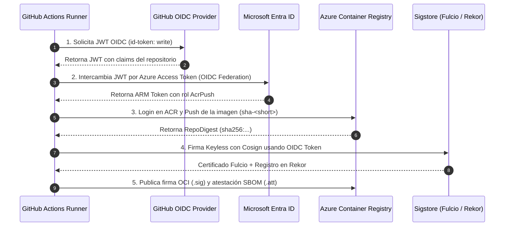

# Publicación en Azure Container Registry (ACR) vía OIDC y Firma Criptográfica con Cosign (P2-05)

## 1. Contexto y Objetivos de Seguridad

En un modelo de seguridad Zero-Trust para entornos de producción en Kubernetes, **el clúster no debe confiar ciegamente en ninguna imagen** por el simple hecho de que se encuentre en un registro de contenedores. Para garantizar que únicamente los artefactos generados, testeados y validados por nuestro pipeline oficial de CI puedan ser admitidos y ejecutados (regla que se forzará en **P6** con **Kyverno**), se requiere:

1. **Autenticación sin Secretos (Secretless CI):** Conectar GitHub Actions con Azure mediante **OIDC (OpenID Connect)** e identidades federadas de Microsoft Entra ID, eliminando el uso de `CLIENT_SECRET` o credenciales estáticas de larga vida.
2. **Principio de Menor Privilegio (PoLP):** Otorgar a la identidad de CI únicamente el rol `AcrPush` y `Reader` delimitado estrictamente al recurso del ACR (`acrdevsrelab01`).
3. **Inmutabilidad y Trazabilidad:** Etiquetar las imágenes con el SHA corto del commit (`sha-<corto>`), publicar tags semánticos en releases (`vX.Y.Z`) y firmar siempre sobre el **digest inmutable** (`@sha256:...`), nunca sobre etiquetas mutables.
4. **Firma Criptográfica Keyless (Sigstore / Cosign):** Firmar digitalmente los artefactos utilizando certificados x509 efímeros emitidos por **Fulcio** basados en la identidad OIDC de GitHub Actions, auditados en el registro público de transparencia **Rekor**.
5. **Atestación de SBOM:** Vincular criptográficamente el inventario de software (SBOM SPDX 2.3 generado por Syft) como una atestación *in-toto* adjunta a la imagen en el ACR.

---

## 2. Arquitectura de Identidad y Publicación



---

## 3. Configuración de Azure y Permisos RBAC

### Componentes Aprovisionados:
* **Resource Group:** `rg-devops-sre-ci-eastus2` (Suscripción `devops-sre-lab` - `43e1b4cf-e76c-4af6-b8cd-01f806c0ab09`).
* **ACR:** `acrdevsrelab01` (SKU `Basic`, `admin-enabled: false`, ~$0.16 USD/día).
* **Entra ID App Registration:** `gh-online-boutique-ci` (`AppId: 6483596f-915c-44c6-aad5-3d60a5411655`).
* **Asignaciones de Rol (RBAC):**
  - `AcrPush` delimitado al ACR `acrdevsrelab01`.
  - `Reader` delimitado al ACR `acrdevsrelab01`.
* **Credenciales Federadas (Federated Identity Credentials):**
  - `gh-main-immutable` & `gh-main-standard` (`ref:refs/heads/main`).
  - `gh-pr-immutable` & `gh-pr-standard` (`pull_request`).

### Variables Configuradas en el Repositorio de GitHub:
- `AZURE_CLIENT_ID`: `6483596f-915c-44c6-aad5-3d60a5411655`
- `AZURE_TENANT_ID`: `2b7bcb47-ffe5-493a-931b-e39e6e3a5106`
- `AZURE_SUBSCRIPTION_ID`: `43e1b4cf-e76c-4af6-b8cd-01f806c0ab09`
- `ACR_NAME`: `acrdevsrelab01`

---

## 4. Estrategia de Etiquetado y Firma

### 1. Etiquetado
| Evento | Etiqueta(s) Publicada(s) | Propósito |
| :--- | :--- | :--- |
| **Pull Request / Branch** | `sha-<short>` | Identificador inmutable y reproducible por commit. |
| **Push a `main`** | `sha-<short>` + `latest` | Tag inmutable para auditoría y tag móvil para última versión estable. |
| **Release de versión** | `vX.Y.Z` | Versión semántica formal del software. |

### 2. Firma Keyless sobre el Digest
La firma **nunca se realiza sobre un tag mutable** (como `latest` o `v1.0.0`), ya que un atacante o error operacional podría mover la etiqueta hacia otra imagen no autorizada. Cosign firma el **digest inmutable**:

```bash
# Extracción del digest del manifiesto publicado
REPO_DIGEST=$(docker inspect --format='{{range .RepoDigests}}{{.}}{{"\n"}}{{end}}' "${IMAGE_NAME}:sha-${SHORT_SHA}" | grep "^${IMAGE_NAME}@" | head -n1)

# Firma keyless con Cosign
cosign sign --yes "${REPO_DIGEST}"
```

### 3. Atestación del SBOM (Software Bill of Materials)
El archivo SBOM generado por Syft en formato SPDX 2.3 JSON (`sbom-<servicio>.spdx.json`) se adjunta a la imagen en el ACR como una atestación criptográficamente firmada:

```bash
cosign attest --yes --predicate "sbom-${SERVICE}.spdx.json" --type spdx "${REPO_DIGEST}"
```

---

## 5. Guía de Verificación Local para Auditoría / SecOps

Cualquier ingeniero o sistema de auditoría puede verificar localmente la autenticidad e integridad de la imagen directamente desde el ACR:

### 1. Iniciar sesión en el registro:
```bash
az acr login --name acrdevsrelab01
```

### 2. Verificar la firma de la imagen:
```bash
cosign verify \
  --certificate-identity-regexp "https://github.com/miguelortiz13/online-boutique-ci/" \
  --certificate-oidc-issuer "https://token.actions.githubusercontent.com" \
  acrdevsrelab01.azurecr.io/frontend@sha256:<DIGEST>
```

**Resultado esperado:**
Cosign valida la cadena de certificados efímeros de Fulcio, comprueba la inclusión en el log de transparencia de Rekor y emite el payload JSON confirmando que la imagen fue construida y firmada exclusivamente por el pipeline de GitHub Actions del repositorio `miguelortiz13/online-boutique-ci`.

### 3. Verificar la atestación del SBOM:
```bash
cosign verify-attestation \
  --type spdx \
  --certificate-identity-regexp "https://github.com/miguelortiz13/online-boutique-ci/" \
  --certificate-oidc-issuer "https://token.actions.githubusercontent.com" \
  acrdevsrelab01.azurecr.io/frontend@sha256:<DIGEST>
```

---

## 6. Conexión con los Próximos Proyectos

* **P2-06:** Con la imagen publicada y firmada, el pipeline abrirá automáticamente un Pull Request hacia el repositorio `platform-gitops` actualizando la referencia de la imagen con el tag inmutable `sha-<short>`.
* **P6 (Seguridad Kubernetes):** El clúster AKS contará con políticas de **Kyverno** que verificarán la firma `cosign` en el momento de la admisión del pod, rechazando cualquier contenedor que no cuente con una firma válida generada por este pipeline.
