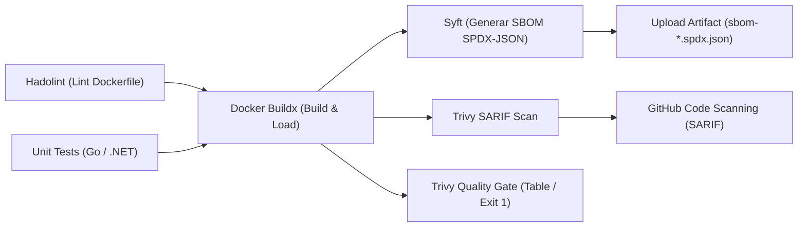

# Escaneo de Vulnerabilidades con Trivy y SBOM con Syft (P2-04)

## 1. Contexto y Objetivos de Seguridad

En arquitecturas de microservicios modernas, el código fuente representa solo una fracción del software que realmente corre en producción; la gran mayoría del artefacto está compuesto por dependencias de terceros, librerías del sistema operativo y paquetes base.

La **seguridad de la cadena de suministro de software (Software Supply Chain Security)** busca garantizar:
1. **Transparencia Total (SBOM):** Conocer de manera exhaustiva cada paquete, versión, licencia y archivo binario incorporado en la imagen de contenedor.
2. **Detección Temprana de CVEs:** Identificar vulnerabilidades conocidas (Common Vulnerabilities and Exposures) antes de que la imagen sea publicada en un registro de producción (ACR) o desplegada en el clúster (AKS).
3. **Quality Gate Automatizado:** Bloquear la integración si se detectan vulnerabilidades de severidad `CRITICAL` que dispongan de parche de corrección (`--ignore-unfixed`).
4. **Visibilidad Centralizada:** Integrar los reportes en formato estándar **SARIF (Static Analysis Results Interchange Format)** directamente en la pestaña **Security → Code scanning** de GitHub.

---

## 2. Arquitectura del Pipeline de Seguridad

El flujo en `.github/workflows/ci.yaml` sigue una secuencia de control progresivo (*shift-left*):



### Componentes de la Etapa de Análisis de Contenedores

| Herramienta | Versión | Rol | Formato de Salida | Criterio de Bloqueo |
| :--- | :--- | :--- | :--- | :--- |
| **Syft** (`anchore/sbom-action`) | `v0.24.2` | Generación de SBOM | SPDX 2.3 JSON (`.spdx.json`) | Informativo / Auditoría |
| **Trivy (SARIF)** (`aquasecurity/trivy-action`) | `0.36.0` | Ingesta en GitHub Security | SARIF 2.1.0 (`.sarif`) | No bloqueante (`exit-code: 0`), sube siempre |
| **Trivy (Gate)** (`aquasecurity/trivy-action`) | `0.36.0` | Puerta de calidad en CI | Salida tabular en consola | Falla (`exit-code: 1`) si existen CVEs `CRITICAL` con parche |

---

## 3. Generación y Gestión del SBOM (Software Bill of Materials)

Se utiliza **Syft** (desarrollado por Anchore) directamente sobre el daemon Docker del runner tras la compilación de la imagen.

### Configuración en el Workflow:
```yaml
- name: Generate SBOM with Syft
  uses: anchore/sbom-action@v0.24.2
  with:
    image: ${{ matrix.service }}:${{ github.sha }}
    format: spdx-json
    output-file: sbom-${{ matrix.service }}.spdx.json
    upload-artifact: false

- name: Upload SBOM Artifact
  uses: actions/upload-artifact@v4
  with:
    name: sbom-${{ matrix.service }}
    path: sbom-${{ matrix.service }}.spdx.json
```

### Características del Formato SPDX 2.3 JSON:
- Estándar internacional **ISO/IEC 5962:2021**.
- Detalla:
  - Metadatos del documento y hashes criptográficos de la imagen (`SHA-256`).
  - Relaciones jerárquicas (`CONTAINS`, `DESCRIBES`).
  - Inventario de librerías del lenguaje (e.g. Go modules como `golang.org/x/net`, `google.golang.org/grpc`, OpenTelemetry).
  - Paquetes a nivel de sistema operativo (e.g. `tzdata`, `netbase`, certificados CA de distroless).
- Disponible para descarga como artefacto individual por cada microservicio compilado en la sección **Artifacts** de cada corrida de GitHub Actions.

---

## 4. Escaneo de Vulnerabilidades y Quality Gate con Trivy

El escaneo de vulnerabilidades se ejecuta en dos pasos complementarios:

### 1. Ingesta SARIF en GitHub Code Scanning:
```yaml
- name: Run Trivy Vulnerability Scanner (SARIF)
  uses: aquasecurity/trivy-action@0.36.0
  with:
    image-ref: ${{ matrix.service }}:${{ github.sha }}
    scan-type: 'image'
    format: 'sarif'
    output: 'trivy-results-${{ matrix.service }}.sarif'
    severity: 'CRITICAL,HIGH'
    ignore-unfixed: true
    trivyignores: '.trivyignore'

- name: Upload Trivy SARIF Report
  uses: github/codeql-action/upload-sarif@v3
  if: always()
  with:
    sarif_file: 'trivy-results-${{ matrix.service }}.sarif'
    category: 'trivy-${{ matrix.service }}'
```
*Requiere el permiso `security-events: write` en el token de GitHub Actions.*

### 2. Quality Gate con Fallo Inmediato:
```yaml
- name: Run Trivy Vulnerability Scanner (Quality Gate)
  uses: aquasecurity/trivy-action@0.36.0
  with:
    image-ref: ${{ matrix.service }}:${{ github.sha }}
    scan-type: 'image'
    format: 'table'
    exit-code: '1'
    severity: 'CRITICAL'
    ignore-unfixed: true
    trivyignores: '.trivyignore'
```

### Justificación de `--ignore-unfixed`:
Cuando se detecta una vulnerabilidad en un componente para el cual el proveedor upstream no ha publicado aún un parche oficial o versión corregida, bloquear el pipeline de CI no ofrece una vía de remediación ejecutable por el equipo de desarrollo y genera fatiga de alertas. Al usar `--ignore-unfixed: true`, el gate solo se bloquea cuando existe una acción correctiva disponible (como actualizar la versión del paquete o la imagen base).

---

## 5. Política de Excepciones y Gobernanza (`.trivyignore`)

Para los casos en los que un CVE reportado sea un falso positivo comprobado, o se trate de una vulnerabilidad cuyo vector de ataque no es explotable en el entorno de ejecución de Online Boutique, se establece una política estricta de gestión de excepciones mediante el archivo `.trivyignore`.

### Reglas de Gobernanza:
1. **Cero Excepciones Indocumentadas:** No se aceptan entradas de CVEs sin un bloque de comentarios justificativo estructurado.
2. **Plantilla Obligatoria de Excepción:**
   ```text
   # CVE-YYYY-XXXXX
   # - Reason: [Justificación técnica de por qué no es explotable en el contenedor]
   # - Context: [Servicio afectado y superficie de red]
   # - Ticket: [Enlace al Issue / Work Item de Azure DevOps o GitHub]
   # - Expiration: [YYYY-MM-DD - Validez máxima permitida: 90 días]
   # - ApprovedBy: [Nombre / Rol del aprobador de seguridad]
   CVE-YYYY-XXXXX
   ```
3. **Caducidad Automática:** Las excepciones deben ser revisadas al vencimiento del plazo (máximo 90 días) durante las revisiones de seguridad periódicas.

---

## 6. Validación Empírica Local

### Prueba de Escaneo Trivy sobre `frontend:local`:
```bash
docker run --rm -v /var/run/docker.sock:/var/run/docker.sock \
  aquasec/trivy:latest image --severity CRITICAL,HIGH --ignore-unfixed frontend:local
```

**Resultado:**
```text
Report Summary
┌──────────────────────────────┬──────────┬─────────────────┬─────────┐
│            Target            │   Type   │ Vulnerabilities │ Secrets │
├──────────────────────────────┼──────────┼─────────────────┼─────────┤
│ frontend:local (debian 13.7) │ debian   │        0        │    -    │
├──────────────────────────────┼──────────┼─────────────────┼─────────┤
│ src/server                   │ gobinary │        0        │    -    │
└──────────────────────────────┴──────────┴─────────────────┴─────────┘
```
Debido a la elección de imágenes base minimalistas (`gcr.io/distroless/static:nonroot`), la superficie de ataque del sistema operativo base es prácticamente nula.

### Prueba de Generación Syft sobre `frontend:local`:
```bash
docker run --rm -v /var/run/docker.sock:/var/run/docker.sock \
  anchore/syft:latest frontend:local -o spdx-json
```
**Resultado:** Generación exitosa de documento SPDX 2.3 catalogando 35 paquetes y dependencias (`golang.org/x/*`, `google.golang.org/*`, `tzdata`, `netbase`).
